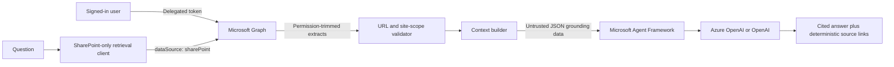

# SharePoint Retrieval Agent

A runnable Python sample that uses the stable Microsoft Graph
`POST /v1.0/copilot/retrieval` API to retrieve permission-trimmed SharePoint extracts, stitches
those extracts into grounded context, and uses Microsoft Agent Framework plus an LLM to produce a
cited answer.

The retrieval path is intentionally **SharePoint-only**:

- `dataSource` is hardcoded to `sharePoint`.
- OneDrive (`oneDriveBusiness`) and Copilot connectors (`externalItem`) cannot be selected.
- Mail and Teams message APIs are never called.
- Every returned URL is validated as SharePoint Online before its text reaches the LLM.
- Selected-site mode post-filters every hit against the site allowlist. This fails closed even if an
  invalid KQL filter were ever accepted without scoping by the Retrieval API.

> Files in Teams channels are stored in SharePoint and can therefore appear as SharePoint documents.
> Teams **messages** cannot appear. To exclude documents from Teams-connected sites too, use explicit
> `--site` allowlists rather than `--all-sites`.

## Architecture



The explicit retrieve-then-synthesize pipeline is deliberate: the application, not the model,
controls the data source and site scope. An optional tool-calling version is also available for the
Foundry Toolkit Agent Inspector.

## Prerequisites

- Python 3.11 through 3.14.
- A work or school Microsoft Entra account.
- A Microsoft 365 Copilot add-on license, or Retrieval API pay-as-you-go enabled for tenant-level
  SharePoint retrieval (pay-as-you-go is currently preview).
- A Microsoft Entra app registration configured for delegated user authentication.
- An LLM deployment. Azure OpenAI with the v1 Responses API is the recommended default.

The Retrieval API supports delegated permissions only. Application permissions, service principals,
and managed identities cannot call it without a signed-in user. The sample uses MSAL Python's public
client and device-code flow for local development; no application secret is used.

## 1. Register the Microsoft Graph client

In Microsoft Entra admin center or Azure portal:

1. Create an app registration. A single-tenant app is simplest for an internal sample.
2. Open **Authentication**. Under **Advanced settings**, set **Allow public client flows** to
  **Yes**, then select **Save**. Device-code flow has no redirect URI, so this setting is how Entra
  classifies the request as a public client.
3. Add these **Microsoft Graph delegated permissions**:
   - `Files.Read.All`
   - `Sites.Read.All`
4. Grant tenant admin consent if required by your organization.
5. Copy the **Directory (tenant) ID** into `GRAPH_TENANT_ID` and the **Application (client) ID** into
  `GRAPH_CLIENT_ID`. Do not use the app registration's Object ID.

Do not create a client secret for this local desktop/device-code sample. A desktop public client
cannot safely hold one. If organizational policy prohibits public client flows, use a separate
approved public-client registration for local development or replace the CLI sign-in with a web
application and delegated on-behalf-of architecture.

The API always applies the signed-in user's existing SharePoint permissions, sensitivity labels,
information barriers, and compliance controls.

## 2. Configure the synthesis model

The sample defaults to Azure OpenAI's v1 Responses API and recommends a `gpt-5.4-mini` deployment for
strong synthesis at moderate cost. The model deployment name is configurable.

For local Microsoft Entra authentication, grant the developer identity the **Cognitive Services
OpenAI User** role on the Azure OpenAI resource and use `AZURE_OPENAI_AUTH_MODE=azure_cli`.
Production Azure hosting should use `managed_identity`. API-key mode is available for a quick test but
is not the recommended production configuration.

Direct OpenAI is also supported with `LLM_PROVIDER=openai`.

## 3. Install and configure

PowerShell:

```powershell
Copy-Item .env.example .env
.\.venv\Scripts\python.exe -m pip install -r requirements.txt
```

Edit `.env`:

```dotenv
GRAPH_TENANT_ID=<tenant-id>
GRAPH_CLIENT_ID=<public-client-app-id>

LLM_PROVIDER=azure_openai
AZURE_OPENAI_BASE_URL=https://<resource>.openai.azure.com/openai/v1/
AZURE_OPENAI_MODEL=gpt-5.4-mini
AZURE_OPENAI_AUTH_MODE=azure_cli
```

For a default selected-site scope, add canonical paths separated by semicolons:

```dotenv
SHAREPOINT_SITE_URLS=https://contoso.sharepoint.com/sites/Engineering/;https://contoso.sharepoint.com/sites/Policies/
ALLOW_ALL_SITES=false
```

For path filters, use the path shown in SharePoint's **Details** pane. Do not use a sharing link or an
address-bar URL containing query parameters.

## Run

Ask against one site:

```powershell
.\.venv\Scripts\python.exe -m sharepoint_retrieval_agent ask `
  "What is the current remote work policy?" `
  --site "https://contoso.sharepoint.com/sites/Policies/"
```

Ask against multiple sites:

```powershell
.\.venv\Scripts\python.exe -m sharepoint_retrieval_agent ask `
  "Compare the engineering and security release requirements." `
  --site "https://contoso.sharepoint.com/sites/Engineering/" `
  --site "https://contoso.sharepoint.com/sites/Security/"
```

Ask against every SharePoint site visible to the signed-in user:

```powershell
.\.venv\Scripts\python.exe -m sharepoint_retrieval_agent ask `
  "Where is the corporate travel policy?" `
  --all-sites
```

Start an interactive loop using the scope in `.env`:

```powershell
.\.venv\Scripts\python.exe -m sharepoint_retrieval_agent chat
```

The first retrieval asks MSAL for a cached delegated token. On a cache miss, MSAL prints a device-code
URL and code. Open the URL, enter the code, and finish sign-in in the browser. The process waits while
sign-in completes, then MSAL caches and refreshes the resulting token in memory for its lifetime.

MSAL's device-code flow polls the Microsoft Entra token endpoint while it waits. Before browser sign-in
completes, `HTTP 400 authorization_pending` is an expected protocol response, not a failed Retrieval
API request. Authentication library logs are therefore kept at `WARNING` by default. To inspect them
temporarily, set `AUTH_SDK_LOG_LEVEL=INFO`; avoid sharing those diagnostic logs because request
metadata can be sensitive.

### `AADSTS7000218` during sign-in

This error means Entra treated the app registration as a confidential client and therefore expected
a secret or certificate. For this sample, the fix is **not** to add a secret. Open the app registration
identified by `GRAPH_CLIENT_ID`, select **Authentication**, set **Allow public client flows** to
**Yes**, save, and rerun the command. Also verify that `.env` contains the Application (client) ID,
not the Object ID.

## Scope behavior

| Mode | Retrieval API request | Application post-filter |
| --- | --- | --- |
| One or more `--site` values | KQL `Path:"..." OR Path:"..."` | Exact host plus path-boundary allowlist |
| `--all-sites` | No `filterExpression` | SharePoint Online URLs only; OneDrive personal hosts rejected |
| No CLI scope | Uses `SHAREPOINT_SITE_URLS` | Same selected-site checks |
| `ALLOW_ALL_SITES=true` | Same as `--all-sites` | Same SharePoint-only checks |

The all-sites mode does not enumerate sites. It asks the Retrieval API to search SharePoint without a
path filter, and Microsoft 365 permission-trims results to content the signed-in user may access.

## Answer grounding and citations

1. The API returns up to 25 unordered document hits with one or more text extracts.
2. The sample ranks extracts by `relevanceScore`, deduplicates them, and keeps source URLs.
3. Extracts are serialized as untrusted JSON data with citation IDs.
4. The model is told to ignore instructions embedded in documents and to answer only from the JSON.
5. Application code appends the source list; the model never controls source URLs.
6. If no usable extracts are found, the model is not called.

`MAX_CONTEXT_CHARACTERS` protects the model context window. The default is 120,000 characters. A note
is printed if context has to be truncated.

## Local debugging and Agent Inspector

The repository includes VS Code launch and task configurations. After filling `.env`, press **F5** and
choose **Debug SharePoint Agent with Inspector**. This starts the local Agent Framework endpoint on
port 8088 and opens Foundry Toolkit Agent Inspector.

You can also start it directly:

```powershell
.\.venv\Scripts\python.exe -m agentdev run -p 8088 -v main.py -- --server
```

Inspector mode exposes the Retrieval API as the agent's only tool. The CLI mode remains the preferred
reference implementation because it deterministically retrieves before invoking the model.

## Test and lint

```powershell
.\.venv\Scripts\python.exe -m pytest
.\.venv\Scripts\python.exe -m ruff check .
.\.venv\Scripts\python.exe -m mypy src
```

Tests mock Microsoft Graph and the LLM; no tenant credentials are required.

## Production adaptation

- Replace device-code authentication with your application's Microsoft identity sign-in and an
  on-behalf-of/delegated token flow. Do not switch the Retrieval API to app-only authentication; it is
  unsupported.
- Keep the signed-in user identity associated with each request and never share retrieval results
  between users.
- Keep selected-site scope server-side when it represents a security boundary. Do not accept raw KQL
  from clients.
- Use managed identity for Azure OpenAI (`AZURE_OPENAI_AUTH_MODE=managed_identity`) and Azure RBAC.
- Add distributed rate limiting and honor Graph `429` responses. The Retrieval API currently supports
  up to 200 requests per user per hour.
- Avoid logging questions, extracts, tokens, or generated answers unless your compliance design
  explicitly permits it.
- The retrieved extracts are sent to the configured LLM. Choose a model endpoint and region approved
  for the data, and review that provider's data-handling terms. The sample sets Responses API
  `store=false`.

## Current Retrieval API limits

- Global Microsoft Graph cloud only; sovereign clouds are not currently supported.
- One data source per call and at most 25 results.
- Query strings are limited to 1,500 characters.
- Text in images and charts is not retrieved.
- Semantic/hybrid retrieval supports a defined set of Microsoft 365 file types; other extensions can
  fall back to lexical retrieval.
- Invalid KQL can execute without scoping. This sample constructs KQL from validated URLs and then
  enforces the scope again on returned URLs.

## Official references

- [Microsoft 365 Copilot Retrieval API overview](https://learn.microsoft.com/microsoft-365/copilot/extensibility/api/ai-services/retrieval/overview)
- [Retrieval API reference](https://learn.microsoft.com/microsoft-365/copilot/extensibility/api/ai-services/retrieval/copilotroot-retrieval)
- [Copilot APIs security and authentication](https://learn.microsoft.com/microsoft-365/copilot/extensibility/copilot-apis-security-authentication)
- [Acquire tokens with MSAL Python](https://learn.microsoft.com/entra/msal/python/getting-started/acquiring-tokens)
- [Microsoft Agent Framework](https://learn.microsoft.com/agent-framework/)
- [Azure OpenAI v1 API](https://learn.microsoft.com/azure/foundry/openai/api-version-lifecycle)
